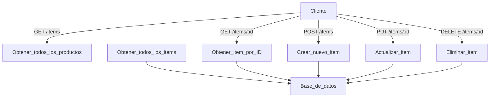

# product-api
API RESTful básica para gestión de productos
# API de Productos

API RESTful básica para gestión de productos

## Endpoints

- `GET /api/products` - Obtener todos los productos
- `GET /api/products/:id` - Obtener un producto específico
- `POST /api/products` - Crear un nuevo producto
- `PUT /api/products/:id` - Actualizar un producto
- `DELETE /api/products/:id` - Eliminar un producto


## Ejemplo de Uso

Crear un producto:
```bash
curl -X POST -H "Content-Type: application/json" \
  -d '{"name":"Nuevo Producto","price":99.99}' \
  https://expert-guide-x5466xv6gg9gf6v6g-3000.app.github.dev//api/products
```
